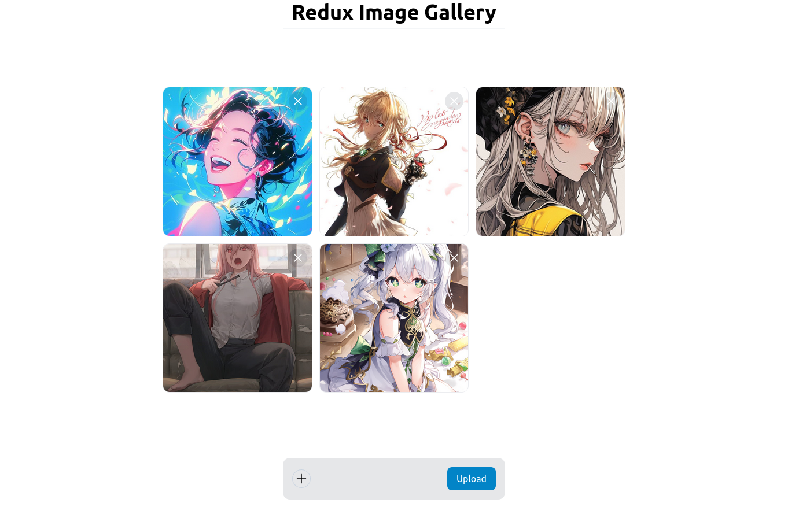

# Redux Image Gallery
<br/>
## Description

Redux Image Gallery is a web application for showcasing and managing a collection of images. It uses Redux for state management.

## Installation

To install the dependencies for Redux Image Gallery, you can use npm:

```sh
cd ./server
npm install
npx nodemon

cd ./redux-app
npm install 
npm run dev
Usage
To start the application, use the following command:

The server will be available at http://localhost:3000.
The application will be available at http://localhost:5173.

Contributing
Contributions to Redux Image Gallery are welcome! Please see our contributing guide for more details.

License
Redux Image Gallery is MIT licensed.

```